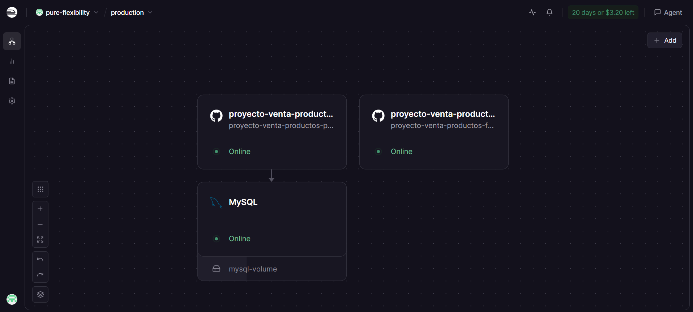

# Documentación de Despliegue (Deploy) - Sportify

Este documento detalla el proceso y la arquitectura utilizada para desplegar la plataforma **Sportify** en el entorno de producción, utilizando la plataforma **Railway**.

## Arquitectura de Red y Servicios

Para el despliegue, hemos optado por una arquitectura de microservicios contenerizados, orquestados dentro del ecosistema de Railway. Esto nos permite tener servicios independientes, escalables y con persistencia de datos.

A continuación, se presenta el esquema de infraestructura actual:

*(Referencia visual basada en la captura de pantalla de la interfaz de Railway)*

### Descripción de los Componentes

Según el esquema superior, la infraestructura se compone de tres servicios principales interconectados:

1.  **`proyecto-venta-productos-p...` (Backend API)**
    * **Tecnología:** Node.js + Express.
    * **Responsabilidad:** Sirve la API RESTful. Maneja la lógica de negocio, la autenticación (JWT/Cookies) y se comunica directamente con la base de datos MySQL.
    * **Origen:** Desplegado automáticamente desde la rama `main` del repositorio de Backend.
    * **Conectividad:** Tiene una flecha hacia abajo indicando que es el único servicio que se conecta y depende del servicio MySQL.

2.  **`MySQL` (Base de Datos)**
    * **Tecnología:** Motor MySQL gestionado por Railway.
    * **Responsabilidad:** Persistencia de todos los datos de la aplicación (productos, usuarios, órdenes, etc.).
    * **Volumen:** Utiliza un volumen adjunto (`mysql-volume`) para garantizar que los datos no se pierdan entre reinicios del servicio.

3.  **`proyecto-venta-productos-f...` (Frontend App)**
    * **Tecnología:** Angular (Single Page Application).
    * **Responsabilidad:** Interfaz de usuario para clientes y empleados. Se comunica con el Backend vía HTTPS para consumir los datos.
    * **Origen:** Desplegado automáticamente desde la rama `main` del repositorio de Frontend.
    * **Nota de Arquitectura:** En el esquema aparece separado del bloque Backend/MySQL. Esto se debe a que, aunque consume la API, es un servicio estático independiente que se sirve al navegador del cliente, el cual luego hace las peticiones al Backend.

---

## Proceso de Configuración en Railway

### 1. Variables de Entorno (Environment Variables)

Para que los servicios se comuniquen correctamente, se configuraron las siguientes variables de entorno críticas en Railway:

**En el servicio Backend:**
* `PORT`: `3000` (Puerto donde escucha la API).
* `JWT_SECRET`: `[Valor_Secreto_y_Largo]` (Clave para firmar los tokens).
* **Variables de conexión a la DB (Provistas por Railway):**
    * `DB_HOST`, `DB_PORT`, `DB_NAME`, `DB_USER`, `DB_PASSWORD`.

**En el servicio Frontend:**
* Se configuró para que las peticiones de API apunten a la URL pública generada por Railway para el servicio Backend (ej: `https://sportify-backend.up.railway.app/api`).

### 2. Configuración de CORS y Seguridad

Un paso crítico para que el Frontend (Angular) pudiera consumir la API fue configurar el **CORS (Cross-Origin Resource Sharing)** en el Backend:

* Se permitieron explícitamente los orígenes HTTPS generados por Railway para el Frontend.
* Se activó `credentials: true` para permitir el envío y recepción de las **Cookies HttpOnly**, fundamentales para nuestro sistema de autenticación seguro.

### 3. Automatización (CI/CD)

Ambos repositorios de GitHub están vinculados a sus respectivos servicios en Railway. Esto significa que cada vez que se hace un `git push` a la rama `main`, Railway detecta el cambio, buildea las nuevas imágenes de Docker (o usa Nixpacks) y actualiza el servicio en producción automáticamente, garantizando un flujo de integración y despliegue continuo.